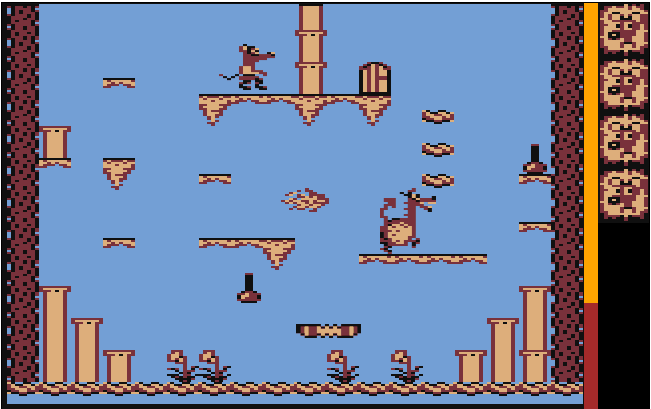
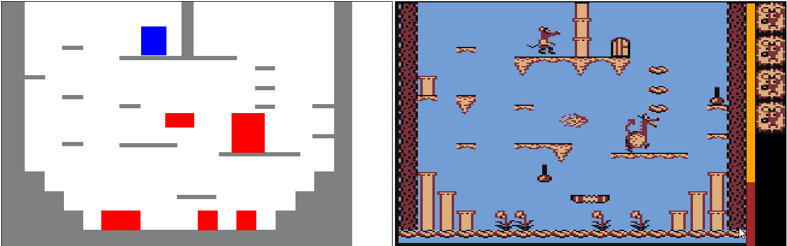

# MouseTrap

Reconstruction of the Atari game in pure JS, project from high school.

##Preview
Original gameplay available here: https://youtu.be/Ufays5N8K9Y

##Mechanics
Game based on pixel collision detection. Each frame is repainted canvas, respectively to hitboxes position.

##Features

-   time limit
-   lives limit
-   2 levels
-   points required to finish level
-   enemies
-   end screen
